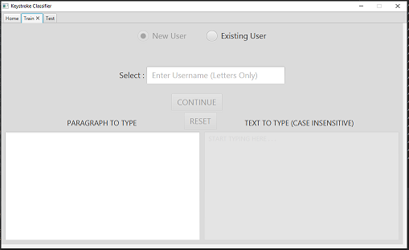

# Keystroke Classifier 
JavaFX based application for user classification based on keystroke patterns. it consists of a training module where users type random given texts for which a number of features are extracted and also a test module that allows a random user to type a given text and it classifies the random user.

A total of 40 features are extracted from the typing input of users which are as listed below:
* Feature 1 - 26 => Average dwell time in seconds for each of the 26 alphabets
* Feature 27 - 36 => Average dwell time for 10 digrams which are: [TH, HE, IN, ER, AN, RE, ND, AT, ON, NT]
* Feature 37 and 38 => Average number of letters typed in every second and every two seconds.
* Feature 39 => Sum of dwell times for the 14 alphabetic keys on the left half of the keyboard which are: [Q,A,Z,W,S,X,E,D,C,R,F,V,T,G]
* Feature 40 => Sum of dwell times for the 12 alphabetic keys on the right side of the keyboard which are: [Y,H,B,U,J,N,I,K,M,O,P,L]

Extracted features are saved in a csv format.

This application uses a knn classifier implement in python to carry out classification. This python file is contained t=in the "python_files" folder of this project. THis python script is called by the application and it runs it against the command line, feeding it all the data it needs such as the dataset location and the test data.  

## Constraints
The data texts which are randomly inputted by users have a few constrainsts which are listed below:
* All text should be in upper case.
* Text must contain all 26 alphabets as well as the 10 digrams specified above
* Text should only be alpha-numeric and not contain special characters such as commas, colons, semi-colons and others.
* Text must not end with one or more spaces

An example of the text is given below.
```
A ZOO IS A FACILITY IN WHICH ANIMALS ARE HOUSED WITHIN ENCLOSURES AND DISPLAYED TO THE PUBLIC. 
ANIMALS IN ZOOS MAY BE ALLOWED TO BREED WHICH IS THE CASE FOR ANIMALS QUITE CLOSE TO EXTINCTION. 
ZOOLOGY REFERS TO THE STUDY OF ANIMALS. THE TERM WAS DERIVED FROM A GREEK WORD. THE WORD ZOO 
WAS FIRST USED OF THE LONDON ZOOLOGICAL GARDENS WHICH WAS OPENED IN THE EIGHTEENTH CENTURY. 
ZOOS WERE VISITED BY OVER 181 MILLION PEOPLE ANNUALLY IN JUST THE UNITED STATES ALONE.
```

In order to verify that a given paragrapgh contains all the alphabets as well as digrams, asimple application was developed which helps validate the text. This application is found by following this[link.](https://github.com/donpelumos/keystroke-paragraph-verifier)</a>

##Dependencies
* Operating System: Windows
* Language: Python 3.4 or newer.
* Libraries: Numpy, Pandas, Scipy, Scikit-Learn

##Gallery
* Home Tab

* Train Tab

* Train Tab

* Test Tab
